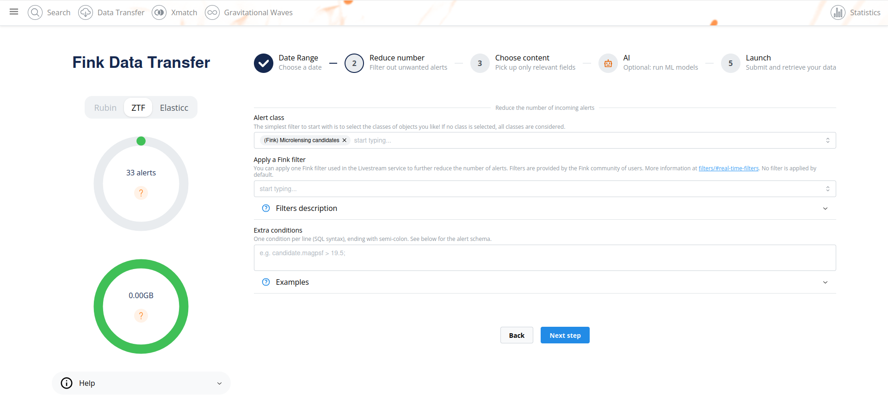
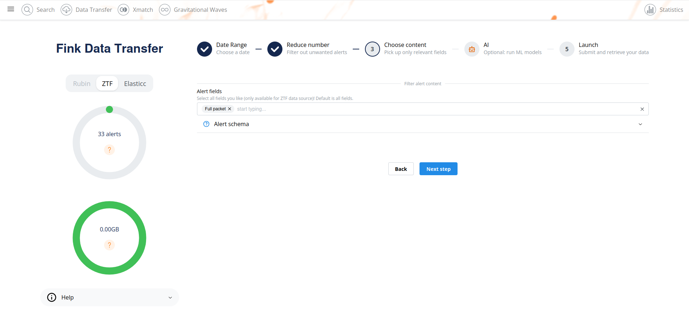
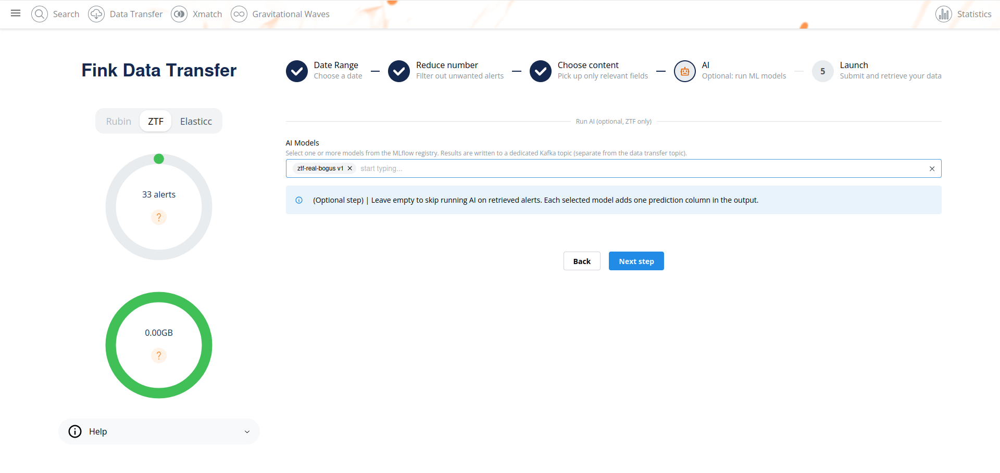

# Fink AI

_date 07/06/2026_

This manual covers the Fink AI service, available at [https://ztf.fink-portal.org/inference](https://ztf.fink-portal.org/inference).
In case of trouble, send us an email (contact@fink-broker.org) or [open an issue](https://github.com/astrolabsoftware/fink-broker/issues).

## Purpose

Fink science modules are programs that run inside the broker pipeline. They enrich every alert with new columns: ML scores, cross-match results, classification labels, etc. Deploying a new or updated science module has historically required:

1. Opening a pull request in the broker repository.
2. Waiting for a code review and a new broker release.
3. Waiting for the new image to be deployed on the production cluster.

This cycle makes it **slow and costly to iterate** on ML models. A researcher who wants to test a new binary classifier on real ZTF alerts had no choice but to wait weeks for the full deployment process, or to run offline experiments on static snapshots which are never fully representative of the live stream.

Beyond deployment delays, there is a deeper constraint: **all science modules share the same execution environment inside the broker**. This means every module must use the same versions of every package: `numpy`, `scikit-learn`, `tensorflow`, etc. A user who needs a specific library version for their model, or who wants to experiment with a new framework, simply cannot do so without potentially breaking every other module in the pipeline. This rigidity severely limits the flexibility researchers need to iterate on their models.

**Fink AI removes both bottlenecks.** It lets any user register a model in the Fink [MLflow](https://mlflow.org/) registry and immediately run it on any slice of historical ZTF data, using its own isolated Docker image with whatever dependencies it needs, without touching the broker codebase, without waiting for a release, and without interfering with anyone else.

Results land in a private Kafka topic within minutes and can be downloaded with the standard [fink-client](fink_client.md).

In short: **Fink AI is a sandbox for science modules.** Same data, same pipeline infrastructure, full dependency isolation, zero deployment friction.

!!! note "Roadmap"
    Fink AI is currently available as part of the [Data Transfer](data_transfer.md) service: it runs on historical data on demand. The long-term goal is to integrate it directly into the **live alert stream**, so that user models can score every new alert in real time, alongside the official Fink science modules.

---

## Using the service

Fink AI is integrated directly into the [Data Transfer](data_transfer.md) page. The workflow is the same 5-step form, with **one new step**: step 4, where you optionally select AI models to run on your alerts.

Steps 1, 2, and 3 (date range, alert filter, and field selection) are identical to a standard data transfer. See [Defining your query](data_transfer.md#defining-your-query) for details.

**Step 2** Filter alerts by class or Fink filter:



**Step 3** Choose which alert fields to include in the output:



**Step 4** Select AI models (optional):



Select one or more models from the MLflow registry. Each selected model adds **one prediction column** in the output. Leave the field empty to skip AI and run a standard data transfer. Models appear in the list only if their MLflow version has both `preprocessing_image` and `model_image` tags set (see [Creating a new model](#creating-a-new-ai-model)).

**Step 5** Launch. After submission the page displays your output topic name and the command to retrieve your data:

```bash
fink_datatransfer \
    -topic fink_ai_2026-06-07_123456 \
    -outdir fink_ai_2026-06-07_123456 \
    -servers 157.136.253.223:24499 \
    --verbose
```

Data is retained for **7 days**.

### Reading the results

```python
import pandas as pd

df = pd.read_parquet("fink_ai_2026-06-07_123456/")
print(df[["objectId", "candid", "prediction"]].head())
```

The output contains at minimum the columns `objectId`, `candid`, `prediction` (first score), `predictions` (full score vector for multi-class models), and `bridge` (model name and version).

---

## Creating a new AI model

A Fink AI model is composed of **two independent Docker images** that are chained together by the pipeline:

```
ZTF alerts (AVRO)
       │
       ▼
┌─────────────────────┐
│  preprocessing Job  │  reads raw alerts → extracts feature vector
└─────────────────────┘
       │  JSON  {objectId, candid, features: [...]}
       ▼
┌─────────────────────┐
│     model Job       │  calls MLflow /invocations → writes predictions
└─────────────────────┘
       │
       ▼
  fink_ai_* (Kafka topic)
```

### Block 1 Preprocessing

The preprocessing image contains a single Python file `preprocessing.py` that exposes a `pre_processing` function:

```python
# preprocessing.py

FEATURE_NAMES = ["rb", "drb", "classtar", "fwhm", "elong", "magpsf"]
N_FEATURES    = len(FEATURE_NAMES)

def pre_processing(alert: dict) -> list[float]:
    """Extract a feature vector from a raw ZTF alert dict.

    Parameters
    ----------
    alert : dict
        Raw ZTF AVRO alert with keys objectId, candid, candidate, prv_candidates.

    Returns
    -------
    list[float]
        Feature vector of length N_FEATURES.  None values must be replaced by 0.0.
    """
    c = alert.get("candidate", {})
    return [
        float(c.get("rb",       0.0) or 0.0),
        float(c.get("drb",      0.0) or 0.0),
        float(c.get("classtar", 0.0) or 0.0),
        float(c.get("fwhm",     0.0) or 0.0),
        float(c.get("elong",    0.0) or 0.0),
        float(c.get("magpsf",   0.0) or 0.0),
    ]
```

**Contract** that `pre_processing` must respect:

| Rule | Why |
|------|-----|
| Returns a `list` of `float` of length exactly `N_FEATURES` | The model expects a fixed-size input |
| Replaces `None` and missing values with `0.0` | Avoids silent shape errors downstream |
| Exports `FEATURE_NAMES` (list of str) and `N_FEATURES` (int) at module level | Used by CI to validate the contract before building |
| No heavy dependencies (`numpy`, `pandas`, …) unless added to `requirements.txt` | Keeps the preprocessing image small |

A `requirements.txt` file must sit next to `preprocessing.py`. It can be empty if only the standard library is used.

The preprocessing image is built automatically by CI using the `Dockerfile` in `mlflow-preprocessing-runner/docker/`. You **do not** build or push the image yourself; CI does it after validating the contract (see [CI and MLflow tags](#ci-and-mlflow-tags)).

### Block 2 Model

The model image wraps your trained MLflow model together with the Kafka bridge. It:

1. Reads the feature envelopes `{"objectId": ..., "candid": ..., "features": [...]}` from the intermediate Kafka topic.
2. Calls the MLflow `/invocations` endpoint with the feature vectors.
3. Writes `{"result": {"predictions": [score]}, "source": {"objectId": ..., "candid": ...}, "bridge": "model@version"}` to the output topic.

You train and log your model with MLflow as usual:

```python
import mlflow
import mlflow.sklearn
from sklearn.ensemble import RandomForestClassifier

with mlflow.start_run():
    clf = RandomForestClassifier()
    clf.fit(X_train, y_train)

    mlflow.sklearn.log_model(
        clf,
        artifact_path="model",
        registered_model_name="my-ztf-classifier",
        input_example=X_train[:5],
    )
```

The model image is also built by CI. It uses `Dockerfile.model` and bundles the Kafka bridge (`fink_datainference.py`) together with `mlflow models serve`.

### CI and MLflow tags

After both images are built and pushed to GHCR, CI sets two tags on the MLflow model version:

| Tag | Value |
|-----|-------|
| `preprocessing_image` | `ghcr.io/your-org/preprocessing:sha-abc123` |
| `model_image` | `ghcr.io/your-org/model-my-ztf-classifier:sha-abc123` |

**A model version only appears in the Fink AI selector if both tags are present.** This guarantees that only successfully built and tested models can be launched.

You can check or set tags manually in the MLflow UI or via the API:

```python
from mlflow import MlflowClient

client = MlflowClient(tracking_uri="https://mlflow-dev.fink-broker.org")
client.set_model_version_tag("my-ztf-classifier", "1", "preprocessing_image", "ghcr.io/...")
client.set_model_version_tag("my-ztf-classifier", "1", "model_image",         "ghcr.io/...")
```

---

## Requirements

### MLflow

You need access to the Fink MLflow registry:

- Tracking URI: `https://mlflow-dev.fink-broker.org`
- Credentials: contact the Fink team to get a username and password.

Set the environment variables before logging your model:

```bash
export MLFLOW_TRACKING_URI=https://mlflow-dev.fink-broker.org
export MLFLOW_TRACKING_USERNAME=your_username
export MLFLOW_TRACKING_PASSWORD=your_password
```

### fink-client

To download results you need `fink-client` ≥ 9.2. See [fink_client.md](fink_client.md) for installation instructions.

### Docker / GHCR (for model authors)

If you are registering a new model, your organisation must have write access to push images to GHCR. The CI pipelines in `mlflow-preprocessing-runner` handle the builds automatically on every push to `main`.

---

## Troubleshooting

### My model does not appear in the selector

Check that both `preprocessing_image` and `model_image` tags are set on the MLflow model version. You can inspect them in the MLflow UI under **Models → your model → version → Tags**.

### The output topic is empty after 10 minutes

- Make sure there is data for the requested dates (check the [statistics endpoint](search/statistics.md)).
- Check that the selected alert classes exist in the date range.
- For K8s-only mode, verify that the input topic `fink_ai_feed_*` has been populated manually.

### `UNKNOWN_TOPIC_OR_PART` error when consuming

The Kubernetes jobs may still be starting up. Wait 2–3 minutes after submission and retry.

### Contact

In case of trouble send an email to contact@fink-broker.org or open an issue on [GitHub](https://github.com/astrolabsoftware/fink-broker/issues).
