# Fink AI

!!! info "Version 07/10/2026"
    This manual covers the Fink AI service, available at [https://ztf.fink-portal.org/download](https://ztf.fink-portal.org/download). In case of trouble, send us an email (contact@fink-broker.org) or [open an issue :lucide-external-link:](https://github.com/astrolabsoftware/ztf.fink-portal.org/issues){target="blank_"}.

## Purpose

Updating a science module in the broker requires a pull request, a review and a new release, and all modules share the same package versions.

**Fink AI is a sandbox for science modules.** Register a model in the Fink [MLflow](https://mlflow.fink-broker.org/) registry and run it on historical ZTF data, in its own Docker image, without touching the broker codebase. It is open to everyone, from the scientific community to amateurs: anyone can publish a model, and anyone can use it.

!!! note "Roadmap"
    Fink AI currently runs on historical data only. The goal is to run user models on the **live alert stream**.

## Requirements

| To... | You need |
|-------|----------|
| Run existing models and download the results | [fink-client](fink_client.md) version 12.0 or later |
| Register your own model | A [Fink MLflow](https://mlflow.fink-broker.org) account |

## MLflow account creation

!!! note "Only to create a model"
    The MLflow account and the access token below are only needed to create and publish a model. To run existing models, go straight to [Using the service](#using-the-service).

**Step 1** Go to [mlflow.fink-broker.org](https://mlflow.fink-broker.org) and sign in with your ORCID or eduGAIN account:

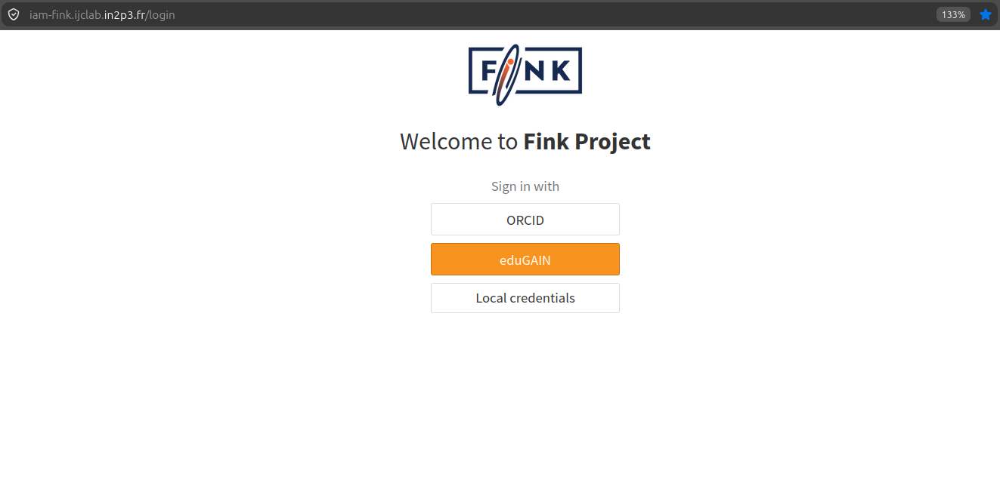

**Step 2** Click **Authorize** to let MLflow use your identity:

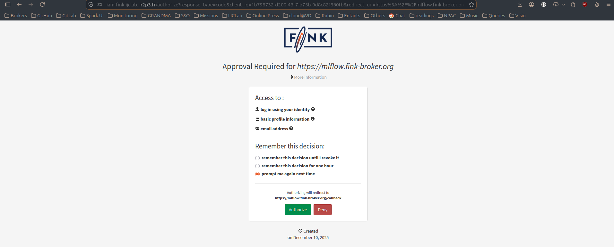

**Step 3** The first time, you get this error, because your account has not been granted access yet:

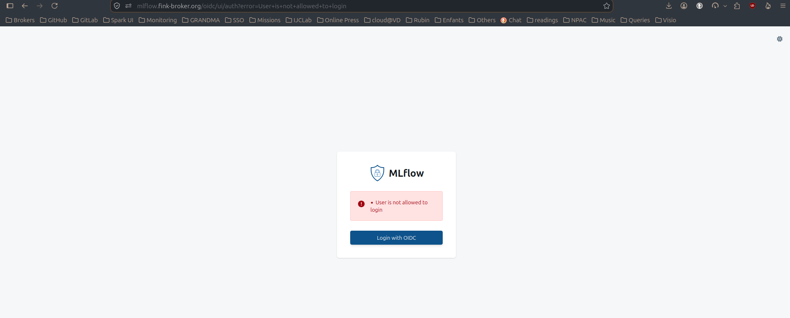

**Step 4** Once you have been granted access, repeat the same steps (if you do not hear from us, leave a message on Slack or email). You land on the MLflow welcome page:

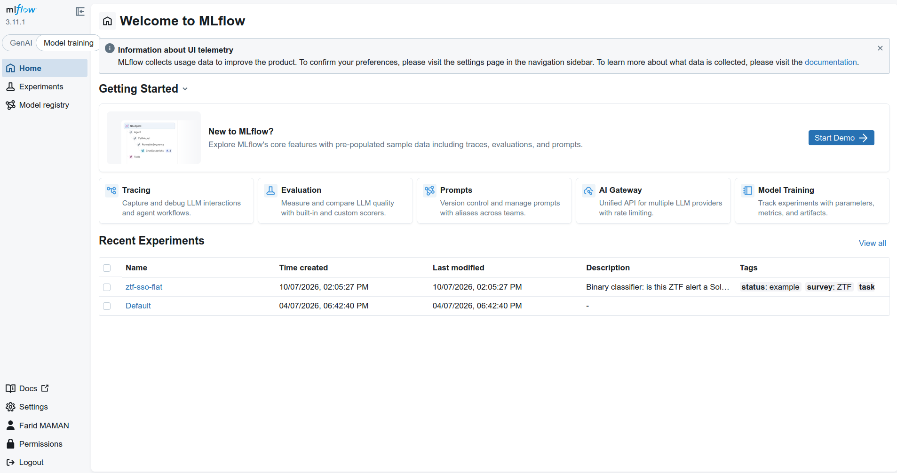

## MLflow authentication

Open your [User Page](https://mlflow.fink-broker.org/oidc/ui/user):

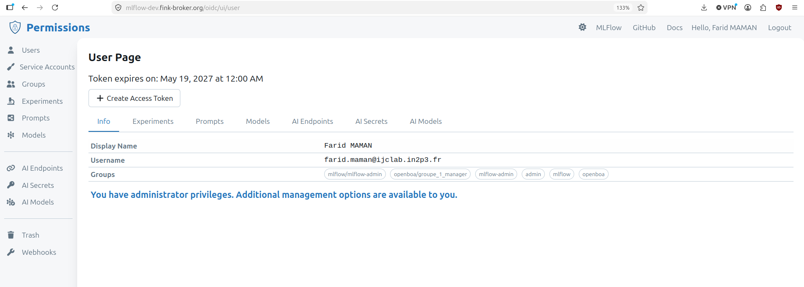

Click **+ Create Access Token**:

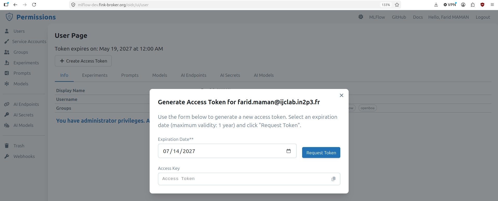

This token is what your code or program uses to log your model to MLflow. Before running it, set the tracking URI, your username (shown on the User Page) and the token as password:

```bash
export MLFLOW_TRACKING_URI=https://mlflow.fink-broker.org
export MLFLOW_TRACKING_USERNAME=your_username
export MLFLOW_TRACKING_PASSWORD=your_access_token
```

## Using the service

Fink AI is the [Data Transfer](data_transfer.md) form with one extra step, step 4. Steps 1 to 3 are unchanged, see [Defining your query](data_transfer.md#defining-your-query).

**Step 1** Choose the dates:

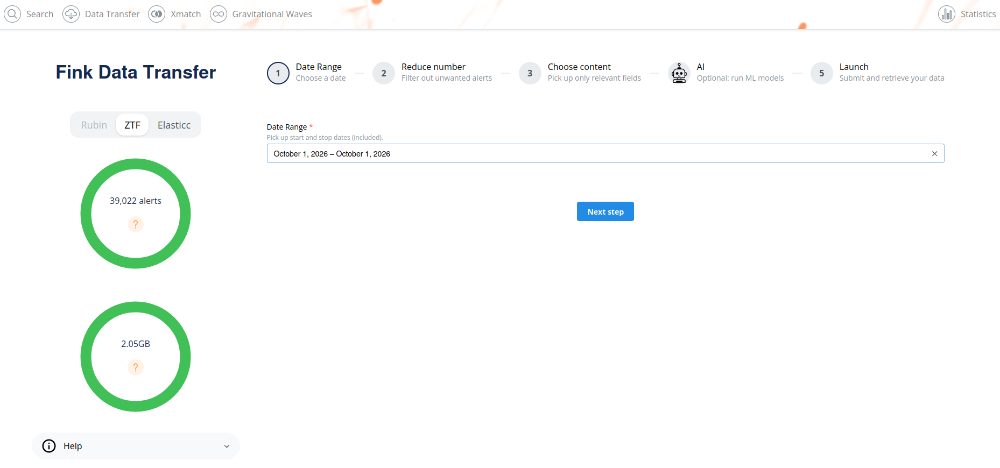

**Step 2** Filter alerts (optional):

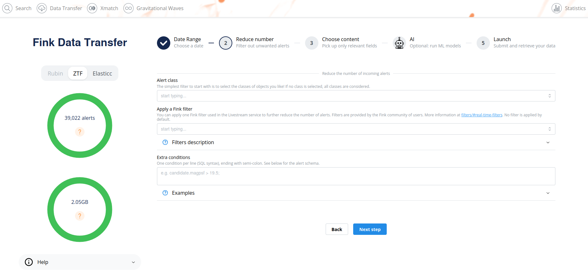

**Step 3** Choose the output fields:

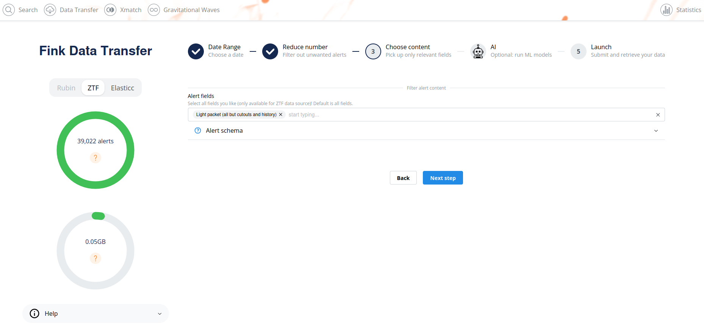

**Step 4** Select one or more AI models, listed with their version and alias. Leave the field empty for a standard data transfer.

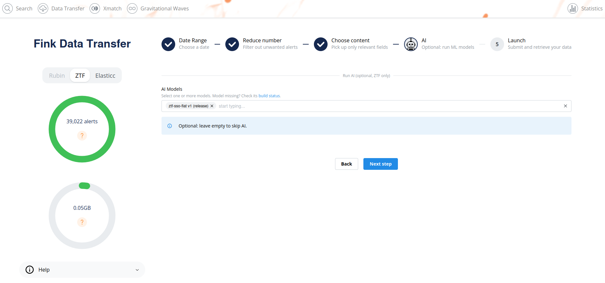

If no model is available yet, you see this message instead (see [Publishing a model](#publishing-a-model)):

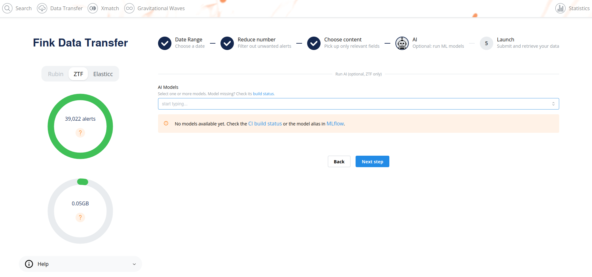

**Step 5** Submit the job. The page is the same as for a standard data transfer: it displays your topic and the command to retrieve your data.


```bash
finkctl transfer \
    -survey ztf \
    -topic fink_ai_2026-10-08_202760 \
    -outdir fink_ai_2026-10-08_202760 \
    -partitionby finkclass \
    --verbose
```

Data is retained for **7 days**.

### Reading the results

The output folder contains parquet files, partitioned by `finkclass`. They hold the alert fields chosen at step 3, plus one column, `model_predictions`:

```python
import polars as pl

df = pl.read_parquet(
    "fink_ai_2026-10-08_202760",
    columns=["objectId", "candid", "finkclass", "model_predictions"],
)

df.head(2)
       objectId               candid  finkclass         model_predictions
0  ZTF26absuzhq  3560140304115015058  Ambiguous  [{"ztf-sso-flat@1",1.0}]
1  ZTF26abuxdqd  3560118260615015042  Ambiguous  [{"ztf-sso-flat@1",1.0}]
```

!!! note "Polars or Pandas?"
    [Polars](https://pola.rs) is a DataFrame library like Pandas, only faster. If you prefer Pandas, `pd.read_parquet("fink_ai_2026-10-08_202760")` reads the same folder.

`model_predictions` is a list with one `{model, prediction}` entry per selected model, where `model` is `name@version`. To get one row per model, with two flat columns `model` and `prediction`:

```python
df = df.explode("model_predictions").unnest("model_predictions")

df.head(2)
       objectId               candid  finkclass           model  prediction
0  ZTF26absuzhq  3560140304115015058  Ambiguous  ztf-sso-flat@1         1.0
1  ZTF26abuxdqd  3560118260615015042  Ambiguous  ztf-sso-flat@1         1.0
```

## Creating a model

A model is **two Docker images** chained by the pipeline:

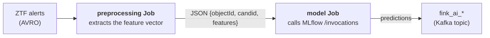
```mermaid
flowchart LR
    A["ZTF alerts<br/>(AVRO)"] --> P["<b>preprocessing Job</b><br/>extracts the feature vector"]
    P -- "JSON {objectId, candid, features}" --> M["<b>model Job</b><br/>calls MLflow /invocations"]
    M -- "predictions" --> K["fink_ai_*<br/>(Kafka topic)"]
```

You provide two things, logged in the **same MLflow run**:

- **The preprocessing**: a `preprocessing.py` file with a `pre_processing(alert)` function that turns a raw alert into a list of floats, plus a `requirements.txt` if it needs dependencies.
- **The model**: any model type supported by MLflow (scikit-learn, PyTorch, TensorFlow, ...), with any Python version, since each model runs in its own container. There is no GPU for now.

CI builds both images for you.

!!! tip "New to MLflow?"
    The model template below is all you need. If you want to learn more about MLflow, you can have a look at the [tutorial notebooks](https://github.com/astrolabsoftware/fink-tutorials/tree/main/ztf/fink%20ai).

**Step 1** Install the [model template](https://github.com/Farid841/model_template). It contains an example preprocessing, a training notebook and the `fink-model` command:

```bash
git clone https://github.com/Farid841/model_template.git
cd model_template
pip install -e .
```

**Step 2** Download training alerts with the [Data Transfer service](data_transfer.md). Select the same content as the one you will choose in Fink AI: `pre_processing()` receives exactly what you selected, during training and in production.

**Step 3** Write the preprocessing in `preprocessing/preprocessing.py`. It defines the names of the features, and a function that turns one alert (a `dict`) into one float per name:

```python
import math

FEATURE_NAMES = ["magpsf", "sigmapsf", "fid"]


def pre_processing(alert):
    """Return the feature vector of one alert, in the order of FEATURE_NAMES."""
    features = []
    for name in FEATURE_NAMES:
        try:
            value = float(alert.get(name))
        except (TypeError, ValueError):
            value = 0.0
        features.append(value if math.isfinite(value) else 0.0)
    return features
```

The preprocessing runs on every alert of the stream, so it must respect three rules:

- **It never raises.** Real alerts have missing and `None` fields: return a default value.
- **It is fast**: less than 5 ms per alert on average. No Pandas DataFrame, no file access, no network call.
- **The order of `FEATURE_NAMES` is the input of the model.** After changing the list, train a new model.

**Step 4** Check the preprocessing on your alerts. The command prints `OK`, or the reason of the failure:

```bash
fink-model check <path-to-alerts>
```

**Step 5** Train and log the model. Set the [MLflow variables](#mlflow-authentication), open `train.ipynb` and edit the marked cells. The notebook relies on three functions:

```python
import fink_model

X, info = fink_model.load_features(ALERTS, columns=["roid"])   # features + label columns
y = (info["roid"] == 3).astype(int)                             # labels

with fink_model.start_run("my-model"):                          # MLflow run
    model.fit(X_train, y_train)
    fink_model.log_model(model)                                 # validated, then uploaded
```

The model receives the output of `pre_processing()` and nothing else: any transformation of the features (scaling, selection...) must be part of the model, for instance with a scikit-learn `Pipeline`.

Each execution creates a new run in MLflow. Nothing is deployed at this stage.

## Publishing a model

A model version appears in the selector **only once both its images are built**.

**Step 1** In the [Fink MLflow UI](https://mlflow.fink-broker.org), open your experiment (`ztf-sso-flat` in this example).

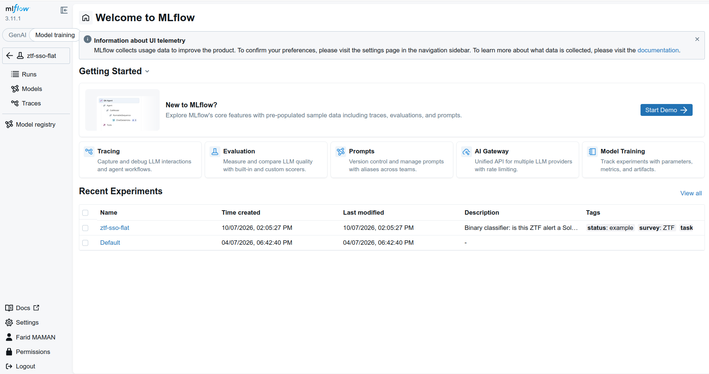

**Step 2** Select the run to publish.

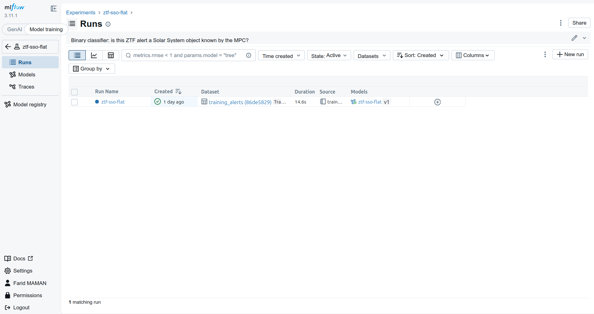

**Step 3** Scroll down to **Logged models** and click on the model name.

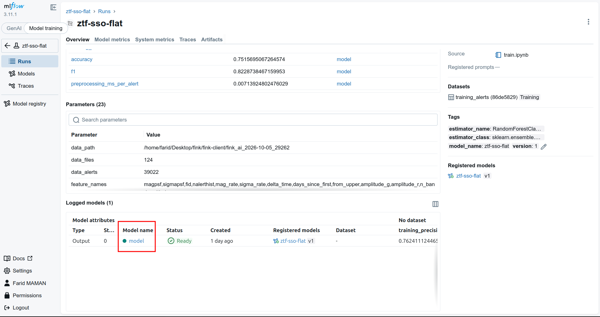

**Step 4** Click on **Register model**. Either create a new registered model, with the same name as the experiment, or select the existing one that matches the experiment you are working on. Each registration creates a new version.

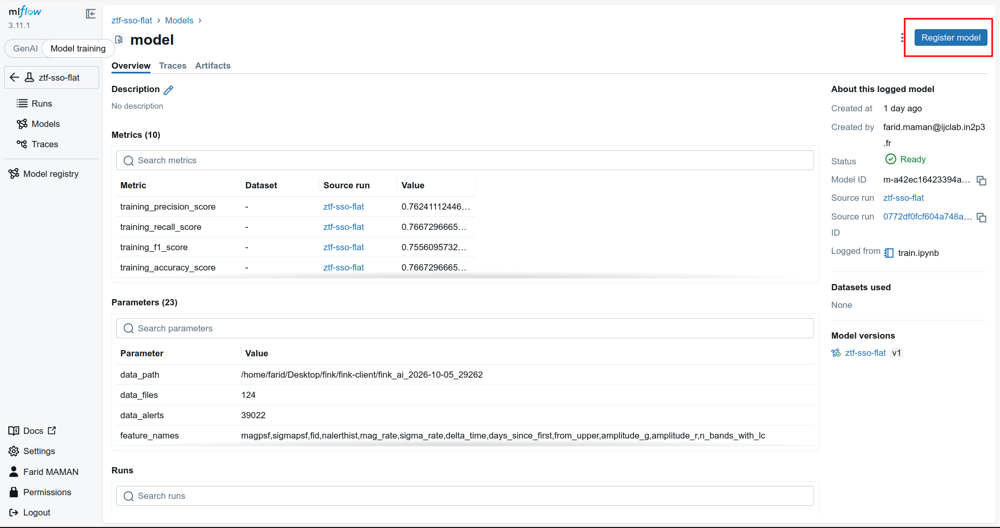

**Step 5** Open the new version and give it an alias (`release` in this example).


!!! warning "Only three aliases trigger the build"
    `release`, `challenger` and `champion`. With any other alias, or no alias, nothing is built and the model never appears in the selector.

**Step 6** Wait for the build. CI validates the preprocessing, builds both images and pushes them to [GHCR](https://docs.github.com/en/packages/working-with-a-github-packages-registry/working-with-the-container-registry). It takes about 30 minutes; follow it in the [GitHub Actions runs](https://github.com/Farid841/pre_processing-container-generator-from-mlflow/actions).

<!-- TODO screenshot: GitHub Actions, a successful build-mlflow-images run

-->

**Step 7** Check the tags. When the build succeeds, CI sets two tags on the model version:

| Tag | Value |
|-----|-------|
| `preprocessing_image` | `ghcr.io/your-org/preprocessing:sha-abc123` |
| `model_image` | `ghcr.io/your-org/model-my-ztf-classifier:sha-abc123` |

They are attached to the version you just published, and visible in the [Fink MLflow UI](https://mlflow.fink-broker.org), under **Model registry → your model → Versions**:

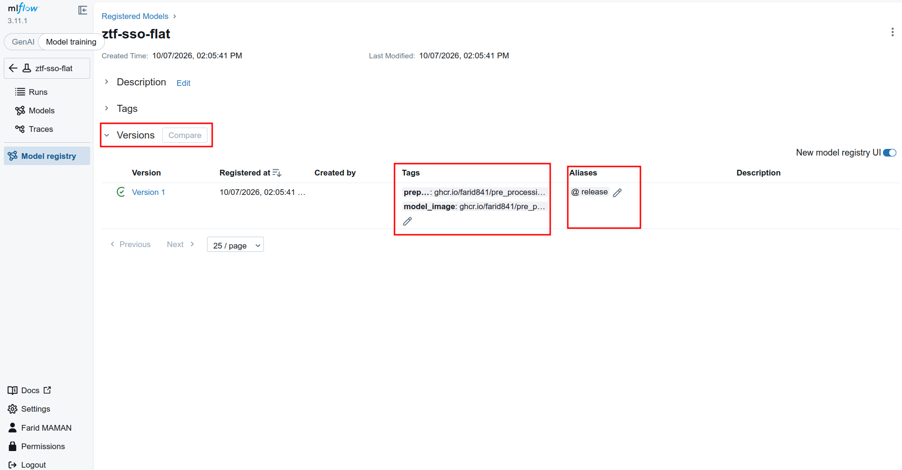

!!! danger "Do not delete anything here"
    MLflow is the source of truth: the service reads the tags and the alias of the version to find your model. If you delete one of them, the model disappears from the selector.

**Step 8** Use your model. Once the tags are set, it appears in the list of AI models of the Fink Science Portal: see [Step 4 of Using the service](#using-the-service).

## Troubleshooting

### MLflow says I am not allowed to login

Your account has not been granted access yet: this is expected the first time (see [MLflow account creation](#mlflow-account-creation)). Once access is granted, sign in again.

### Logging to MLflow fails with an authentication error

Check the three variables of [MLflow authentication](#mlflow-authentication), in the terminal that started Jupyter:

1. `MLFLOW_TRACKING_URI` is `https://mlflow.fink-broker.org`.
2. `MLFLOW_TRACKING_USERNAME` is the username shown on your User Page.
3. `MLFLOW_TRACKING_PASSWORD` is an access token, not the password of your ORCID or eduGAIN account. If in doubt, create a new token.

### `fink-model check` fails

The command prints the reason:

| Message | What to do |
|---------|------------|
| An alert raises, or returns a wrong number of values, a NaN, a string... | Handle missing and `None` fields in `pre_processing()`, and return one finite float per name in `FEATURE_NAMES`. |
| More than 5 ms per alert on average | Remove what is slow: Pandas DataFrame, file access, network call. |
| Every feature is constant across all alerts | The preprocessing does not match the alerts: compare your field names with the available columns listed by the command. |
| One feature is constant across all alerts (warning) | Usually a wrong field name. |

### `log_model()` rejects my model

Either the model does not accept the features returned by `pre_processing()`, or the `preprocessing/` folder changed since `load_features()`. In the second case, run the notebook again from the beginning, so that the model is trained on the current preprocessing.

### My model does not appear in the selector

The `preprocessing_image` or `model_image` tag is missing on the model version. Check, in this order:

1. The version has one of the aliases `release`, `challenger` or `champion`. Without it, no build starts.
2. The build is finished: it takes about 30 minutes.
3. The build did not fail (see below).

### The build of my model or preprocessing fails

Open the [GitHub Actions runs](https://github.com/Farid841/pre_processing-container-generator-from-mlflow/actions) and look at the logs of your run. To start a new build after a fix, log a new version and add the alias again.

### The output topic is empty after 10 minutes

Check that there is data for the requested dates and alert classes on the [statistics page](https://ztf.fink-portal.org/stats) of the portal.

If there is data, the service may be down for maintenance: try again later.

### `UNKNOWN_TOPIC_OR_PARTITION` error when consuming

The jobs are still starting. Wait 2–3 minutes and retry.

If the topic is more than 7 days old, the data is no longer retained: launch the job again.

### The predictions look wrong

Check that the content selected at step 3 is the same as the one used to train the model. `pre_processing()` receives exactly what you selected: with a different selection, the fields it expects are missing and replaced by default values.
